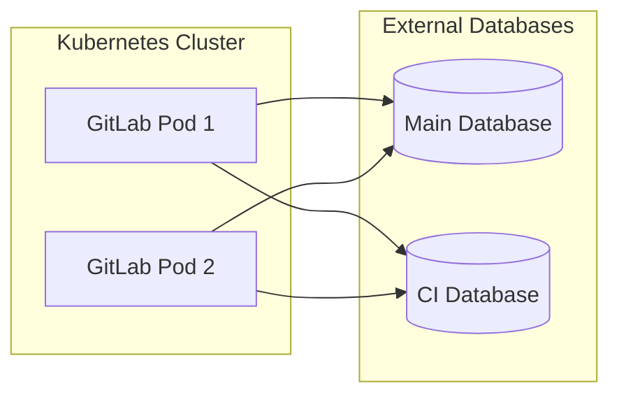

## Configure a new installation GitLab chart with multiple external databases (Beta)

WARNING:
This feature is not ready for production use. Due to [known issues](https://docs.gitlab.com/ee/administration/postgresql/multiple_databases.html#known-issues), configuring GitLab with multiple databases is in [**Alpha**](https://docs.gitlab.com/ee/policy/experiment-beta-support.html).

By default, GitLab uses a single application database, referred to as the `main` database.

To scale GitLab, you can configure GitLab to use multiple external application databases,
namely `main` and `ci`. The following diagram shows how the pods talk to the multiple databases:



Prerequisites:

- All prerequisites listed in the [external database document](../external-db/index.md).
- An additional empty `gitlabhq_production_ci` database, which can be running on the same PostgreSQL
  server as the `gitlabhq_production` database.
- Access to the Kubernetes cluster using
  the [`kubectl`](https://kubernetes.io/docs/reference/kubectl/) and [`helm`](https://helm.sh/docs/intro/install/)
  CLI tools. Refer to the [GitLab chart prerequisites](../../installation/tools.md) for more information.

To set up multiple external databases:

1. Create the Kubernetes secret that holds the PostgreSQL secrets for the database user `gitlab`.
   This password can be different, to support having the multiple databases on two different physical servers
   with different passwords.

   Let's choose the name `gitlab-postgresql-password` for this Kubernetes secret:

   ```shell
   kubectl create secret generic gitlab-postgresql-password \
       --from-literal=main-gitlab-password=<main-database-password> \
       --from-literal=ci-gitlab-password=<ci-database-password>
   ```

1. Add the following to your existing YAML file that you use to
   [deploy the GitLab chart](../../installation/deployment.md)
   (for example `gitlab-values.yaml`), and replace the `host` values with yours:

   ```yaml
   global:
     psql:
       main:
         host: main.database.host # set this to the host of your external main database
         database: gitlabhq_production
         password:
           secret: gitlab-postgresql-password
           key: main-gitlab-password
       ci:
         host: ci.database.host # set this to the host of your external ci database. Can be the same as the one for main database
         database: gitlabhq_production_ci # difference in database containing CI schema, results in `database_tasks: true` as well
         password:
           secret: gitlab-postgresql-password
           key: ci-gitlab-password
   postgresql:
     install: false
   ```

   Where:

    - `postgresql.install`: Set to `false` to disable the embedded database, and use the external database instead.
    - `global.psql.main.host`: Set to the hostname of the external `main` database, can be a domain or an IP address.
    - `global.psql.main.password.secret`: The name of the Kubernetes secret, that was used to hold the PostgreSQL user.
      In our example it's `gitlab-postgresql-password`.
    - `global.psql.main.password.key`: Within the secret, the key that contains the password.
      In our example it's `main-gitlab-password`.
    - `global.psql.ci.host`: Set to the hostname of the external `ci` database, can be a domain or an IP address. It can be the
      same value as `global.psql.main.host` if both databases `main` and `ci` are on the same database server.
    - `global.psql.ci.password.secret`: The name of the Kubernetes secret, that was used to hold the PostgreSQL user.
      In our example it's `gitlab-postgresql-password`.
    - `global.psql.ci.password.key`: Within the secret, the key that contains the password.
      In our example it's `ci-gitlab-password`.

1. Finally, deploy the GitLab chart using `gitlab-values.yaml`:

   ```shell
   helm repo add gitlab https://charts.gitlab.io/
   helm repo update
   helm upgrade --install gitlab gitlab/gitlab --timeout=900s -f gitlab-values.yaml
   ```

## Migrate an existing installation to multiple databases

### Preparation

- Take a backup of the database, by following the steps [here](../../backup-restore/backup.md)
- Locate the toolbox pod: `kubectl get pods -lrelease=RELEASE_NAME,app=toolbox`
- Access the database console using the command `kubectl exec <Toolbox pod name> -it -c toolbox -- gitlab-rails dbconsole`, by providing
the database password. Feel free to replace this a suitable `psql` command from any host that has a direct access to the database server.
- Make sure you have enough disk space, plan for the downtime and create the new `gitlabhq_production_ci` database
using SQL commands outlined [here](../../../ee/administration/postgresql/multiple_databases.md#preparation). Please note
that `sudo gitlab-psql` can be omitted because you already accessed the database console.
- Exit the database console using the command `\q`
- Exit the toolbox pod using the command `exit`.

### Shutting down GitLab

To prevent GitLab from writing to the database while switching to multiple databases setup, we need to shutdown
all the services that write to the GitLab current database.

#### Saving the existing replicas for each database accessing deployment

   ```shell
   rm -f /tmp/deployments.txt
   deployments=$(kubectl get deployment --selector 'app in (webservice, sidekiq, kas, gitlab-exporter)'  --no-headers -o custom-columns=":metadata.name")
   for deployment in ${deployments}
   do
   replicas=$(kubectl get deployment $deployment -o=jsonpath='{.status.replicas}')
   echo "$deployment/$replicas" >> /tmp/deployments.txt
   done
   ```

#### Scaling down the database accessing deployments

   ```shell
   kubectl scale deployment --replicas 0 --selector 'app in (webservice, sidekiq, kas, gitlab-exporter)'
   ```

### Migration of the database

- Access bash on the toolbox pod using the command: `kubectl exec <Toolbox pod name> -it  -c toolbox -- bash`
- From the toolbox pod, run the command `gitlab-rake gitlab:db:decomposition:migrate`. It should print this message
to the standard output `Database migration finished!`.
- Exit the toolbox pod using the command `exit`.

### Reconfigure GitLab with two databases

Switch GitLab to use two databases `main` and `ci`, using this command

   ```shell
   helm upgrade gitlab gitlab/gitlab \
     --set global.psql.database=null \
     --set global.psql.main.database=gitlabhq_production \
     --set global.psql.ci.database=gitlabhq_production_ci \
     --set gitlab.migrations.enabled=false \
     --set global.extraEnv.GITLAB_ALLOW_SEPARATE_CI_DATABASE=1 \
     --reuse-values
   ```

### Verification

- Locate the new toolbox pod using the command: `kubectl get pods -lrelease=RELEASE_NAME,app=toolbox`
- Access the bash on the toolbox pod using the command: `kubectl exec <Toolbox pod name> -it  -c toolbox -- bash`
- Run `cat /srv/gitlab/config/database.yml` to make sure that GitLab config contains both `main` and `ci` and that both
of them are pointing to two different databases: `gitlabhq_production` and `gitlabhq_production_ci`.

### Post-migration and clean up

Before we start GitLab again, we need to make sure we lock the legacy tables for writes, and clean them up.
Use these commands

From inside the toolbox pod, run these commands 

   ```shell
   gitlab-rake gitlab:db:lock_writes
   gitlab-rake gitlab:db:truncate_legacy_tables:main
   gitlab-rake gitlab:db:truncate_legacy_tables:ci
   ```

### Starting GitLab again

   ```shell
   while read line; do
     deployment=$(echo $line|cut -d'/' -f 1)
     replicas=$(echo $line|cut -d'/' -f 2)
     kubectl patch deployment "${deployment}" -p "{\"spec\": {\"replicas\": ${replicas}}}"
   done < /tmp/deployments.txt
   ```
